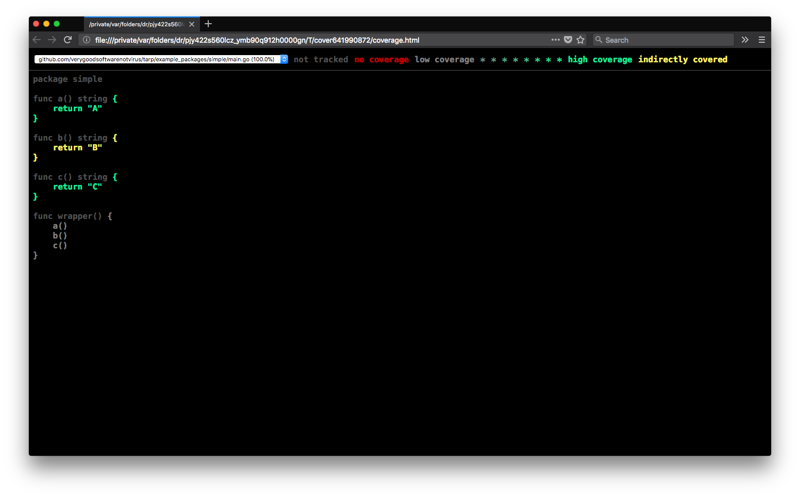

# tarp [](https://travis-ci.org/verygoodsoftwarenotvirus/tarp) [](https://coveralls.io/github/verygoodsoftwarenotvirus/tarp?branch=master) [](https://goreportcard.com/report/github.com/verygoodsoftwarenotvirus/tarp) [](https://hub.docker.com/r/verygoodsoftwarenotvirus/tarp/)

`tarp` is a tool that helps you catch functions which don't have direct unit tests in your Go packages.

## Installation

    go get -u github.com/verygoodsoftwarenotvirus/tarp

## Docker Image

If you don't want to install tarp locally, you can use the pre-built Docker image like so:

    docker run -it --rm -v "$(pwd):/src/pkg" verygoodsoftwarenotvirus/tarp:latest analyze --package pkg

## Purpose

Say, for example, you had the following Go file:

```go
package simple

func A() string {
    return "A"
}

func B() string {
    return "B"
}

func C() string {
    return "C"
}

func wrapper() {
   A()
   B()
   C()
}
```

and you had the following test for that file:

```go
package simple

import (
    "testing"
)

func TestA(t *testing.T) {
    A()
}

func TestC(t *testing.T) {
    C()
}

func TestWrapper(t *testing.T) {
    wrapper()
}
```

Running `go test -cover` on that package yields the following output:

```bash
PASS
coverage: 100.0% of statements
ok      github.com/verygoodsoftwarenotvirus/tarp/example_packages/simple    0.006s
```

However, note that `B` doesn't have a direct test the way that `A` and `C` do. `B` is only "tested" in `TestWrapper`. Because all the functions are called, `-cover` yields a 100% coverage value. If you ever decide that `wrapper` doesn't need to call `B` anymore, and don't delete the function entirely, you'll have a drop in coverage. Running `tarp analyze` on that same package yields the following output:

```bash
Functions without direct unit tests:
in /Users/jeffrey/golang/src/github.com/verygoodsoftwarenotvirus/tarp/example_packages/simple/main.go:
    B on line 7

Grade: 75% (3/4 functions)
```

Additionally, you can use the `cover` command to visualize those functions by passing in a cover profile. So if you ran `go test -coverprofile=coverage.out`, and then ran `tarp cover --html=coverage.out`, a browser window will open that shows untested functions in red, functions without direct tests in yellow, and functions that are directly tested in green, like so:



## Use Cases

What `tarp` seeks to do is catch these sorts of things so that package maintainers can decide what the appropriate course of action is. If you're fine with it, that's cool. If you're not cool with it, then you know what needs to have tests added.

You can also use `tarp` in your CI pipeline to decline PRs that would add functions that don't have direct unit tests. As a matter of fact, `tarp` does just that for itself! [Here](https://github.com/verygoodsoftwarenotvirus/tarp/pull/9) is an example of such a scenario working on this very repository!

I think `tarp` could also be helpful for new developers looking to contribute towards a project. They can run `tarp` on the package and see if there are some functions they could easily add unit tests for, just to get their feet wet in a project.

## Issues

If you've tried tarp on something and found that it didn't accurately handle some code, or panicked, please feel free to [file an issue](https://github.com/verygoodsoftwarenotvirus/tarp/issues/new). Having an example of the code you experienced issues with is pretty crucial, so keep that in mind.

## Known Issues

`tarp` doesn't adequately handle deeply nested method calls. So if you had something like this:

```go
package main

import (
    "testing"
)

/*
// in another file:
type Example struct{}
func methodCall() {
    return
}
*/

func TestMethod(t *testing.T) {
    x := struct{
        First: struct{
            Second: struct{
                Third: Example{},
            },
        },
    }
    x.First.Second.Third.methodCall()
}
```

That should technically satisfy tarp's strict testing requirement, but it doesn't. Tarp can handle single-level selector expressions with great ease, but it doesn't recursively dive into those selectors for a number of reasons.